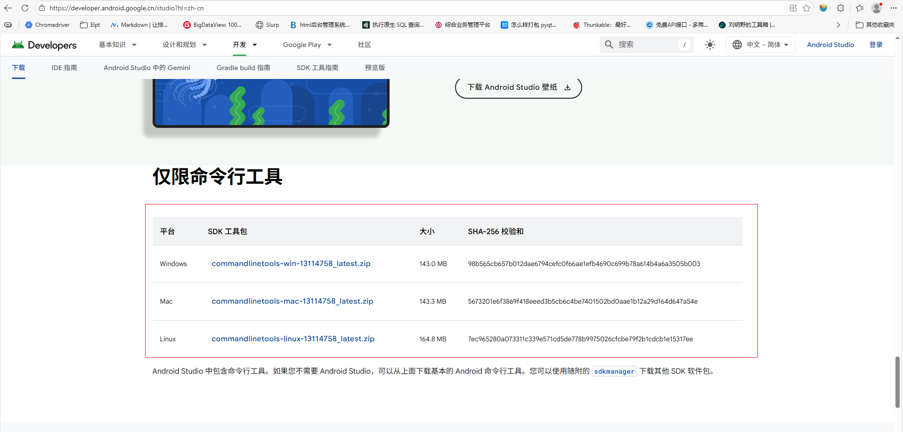
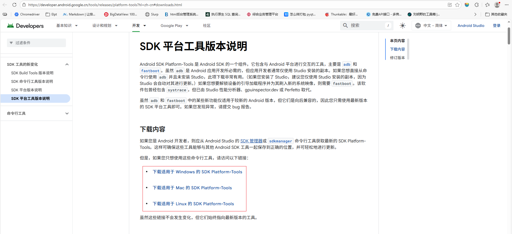
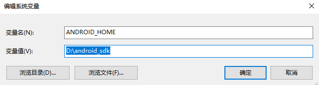
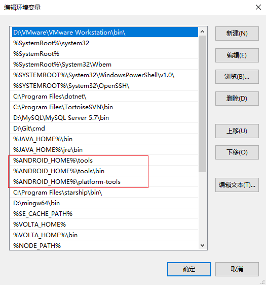

# Android SDK 环境配置指南

本指南将引导您完成 Appium for Android 测试所需的基础环境——Android SDK 的安装与配置。

## 1. 创建 SDK 目录

首先，在您的电脑上选择一个合适的位置（例如 `D:\`），创建一个新目录作为 Android SDK 的根目录。

```
D:\android_sdk
```

## 2. 安装命令行工具 (Command Line Tools)

1. 访问 Android Studio [官方下载页面](https://developer.android.google.cn/studio?hl=zh-cn#command-line-tools-only)
   ，在页面底部找到 **"仅命令行工具"** 部分，下载适用于您操作系统的软件包（例如 `commandlinetools-win-xxxxxxx_latest.zip`）。
   
2. 解压下载的 `zip` 文件。

3. 将解压后得到的 `cmdline-tools` 目录移动到您在第一步创建的 `android_sdk` 目录中。

4. 进入 `android_sdk/cmdline-tools` 目录，在内部创建一个名为 `latest` 的新目录。

5. 将 `cmdline-tools` 目录内的所有内容（包括 `bin` 目录、`lib` 目录、`NOTICE.txt` 和 `source.properties` 文件）移动到刚刚创建的
   `latest` 目录中。

   完成后的目录结构应如下所示：

   ```
   android_sdk/
   ├── cmdline-tools/
   │   └── latest/        ← 必须有这个 'latest' 目录
   │       ├── bin/
   │       │   └── sdkmanager
   │       ├── lib/
   │       └── ...
   ```

## 3. 安装平台工具 (Platform-Tools)

1. 访问 SDK
   平台工具版本说明页面，下载最新的[平台工具包](https://developer.android.google.cn/tools/releases/platform-tools?hl=zh-cn#downloads.html)
   （例如 `platform-tools-latest-windows.zip`）。
   
2. 解压下载的 `zip` 文件。

3. 将解压后得到的 `platform-tools` 目录整个移动到 `android_sdk` 根目录下。

   此时，您的 `android_sdk` 目录结构应如下：

   ```
   android_sdk/
   ├── cmdline-tools/
   ├── platform-tools/
   └── ...
   ```

## 4. 配置环境变量

为了让系统能够识别 `adb`、`sdkmanager` 等命令，需要配置以下环境变量：

1. **新建 `ANDROID_HOME`**:
    * 变量名: `ANDROID_HOME`
    * 变量值: `D:\android_sdk` (替换为您的实际路径)

2. **编辑 `Path` 变量**:
   在系统变量的 `Path` 中，追加以下两项：
   ```
   %ANDROID_HOME%/tools
   %ANDROID_HOME%/tools/bin
   %ANDROID_HOME%/platform-tools
   %ANDROID_HOME%/cmdline-tools/latest/bin
   ```
   
   

> **提示**: 关于环境变量的更多详细设置，请参阅
> Android [官方文档](https://developer.android.google.cn/tools/variables?hl=zh-cn)。

## 5. 验证安装

打开一个新的命令行窗口（CMD 或 PowerShell），输入以下命令：

```sh
adb --version
```

如果成功显示 Android Debug Bridge 的版本信息，则说明 `platform-tools` 已配置成功。

## 6. (可选) 配置 Bundletool

`bundletool` 是 Google 用于处理 Android App Bundles (`.aab` 文件) 的工具。如果 `appium-doctor` 提示
`bundletool.jar cannot be found` 警告，您可以按以下步骤处理：

1. **下载**: 从 bundletool GitHub Releases 页面下载最新的 `bundletool-all-x.x.x.jar` 文件。

2. **创建目录**: 在您的 `ANDROID_HOME` 目录下（例如 `D:\android_sdk`）创建一个名为 `bundle-tool` 的新文件夹。

3. **重命名并移动**: 将下载的 `.jar` 文件重命名为 `bundletool.jar`，然后将其移动到 `bundle-tool` 文件夹中。

4. **配置 PATH**: 将 `bundle-tool` 目录也添加到系统的 `Path` 环境变量中：
   ```
   %ANDROID_HOME%\bundle-tool
   ```

完成以上步骤后，重新运行 `appium-doctor`，相关警告应会消失。